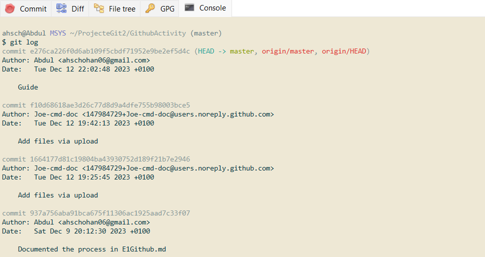
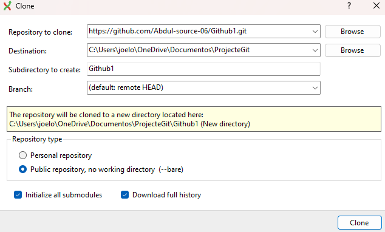

# My experience sharing and cloning a repository with Git Extensions

## Sharing my repository

First, I went to my repository on GitHub. Then, I clicked on the 'Settings' button. In the 'Collaborators' section, I added my classmate's username.

## Cloning a repository with Git Extensions

I opened Git Extensions and clicked on 'Clone repository'. I entered the URL of the repository and chose the local location where I wanted to clone it.

## Including screenshots

To include screenshots in my Markdown file, I first had to upload the images to an image server or to my own GitHub repository. Then, I was able to reference them in my Markdown file in the following way:

